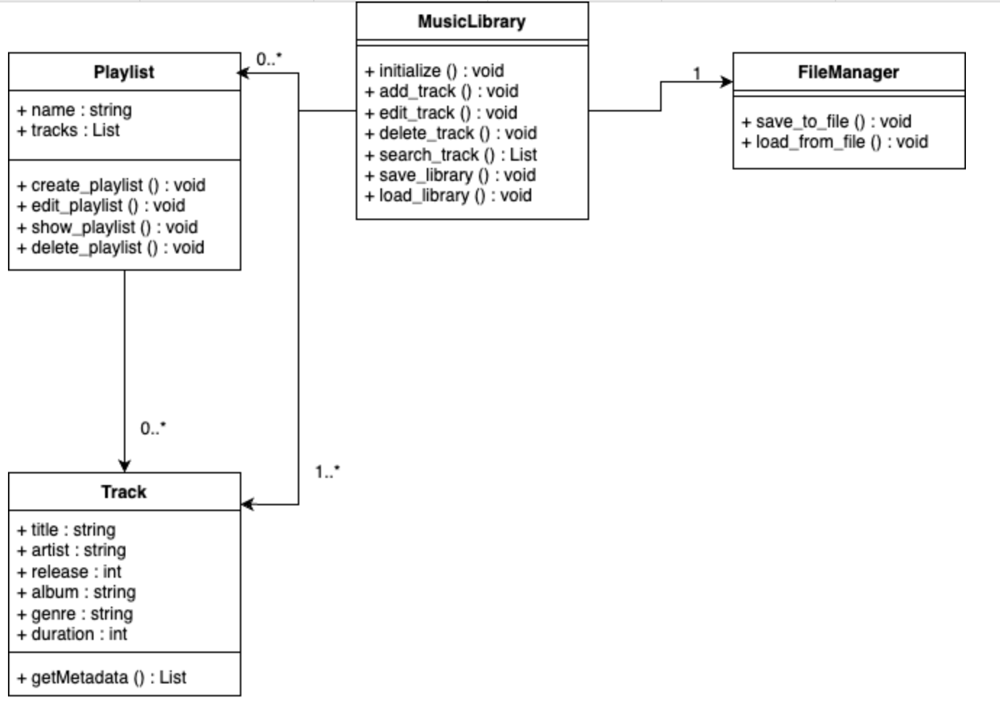

# Projekt-SWT

## Beschreibung Semesterbegleitendes Projekt

Es soll eine Musik-Bibliothek erstellt werden, welche von einem Online-Player genutzt werden kann. ## Funktionsweise Nach öffnen des Programms wird der Benutzer danach gefragt, ob er eine bestehende Musikbibliothek geladen und initiallisiert werden soll oder ob eine neue Bibliothek erstellen werden soll. Anschließend kann in dem CLI Programm mit Zahlen durch das Menü gegangen werden.

## Meta-Daten der Lieder

- Titel
- Künstler
- Erscheinungsjahr
- Album
- Genre
- Länge

## UML-Diagramm

